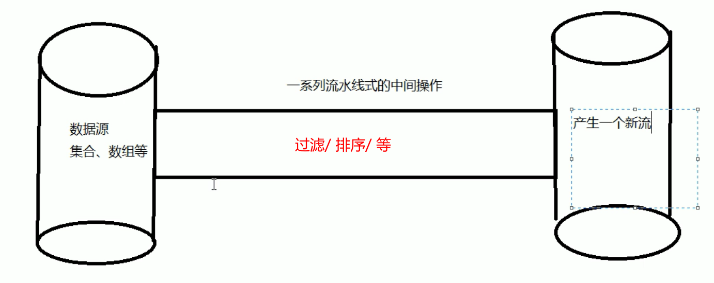
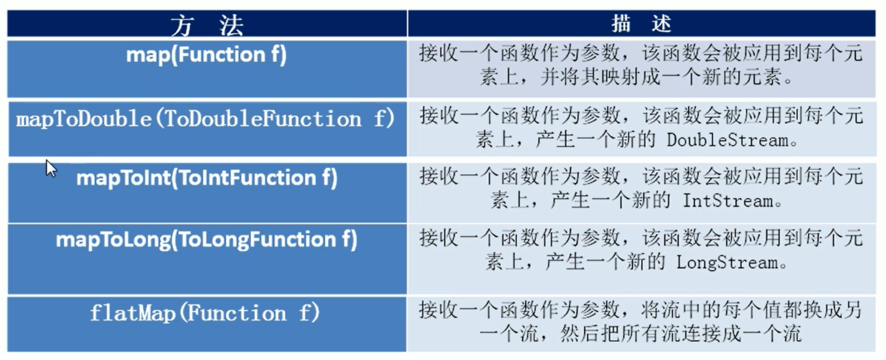

# JavaSE

## Java8 新特性

进度：lambda 第四个 看了一点 ，Stream API 看完  Lambda和Stream 都是从练习题开始没看。


- Lambda表达式
- 函数式接口
- 方法引用与构造器引用
- Stream API
- 接口中默认方法与静态方法
- 新时间日期API
- 其他新特性


### 新特性简介

- 速度更快 （HashMap）
- 代码更少（增加了新的语法Lambda表达式）
- 强大的Stream API  （意味着在Java中操作数据就像操作sql一样方便）
- 便于并行
- 最大化减少空指针异常 Optional

其中最核心的是Labbda表达式，和Stream API


### Lambda表达式

是一个匿名函数，我们可以把Lambda表达式理解为**一段可以传递的代码**（将代码像数据一样进行传递），可以写出更高效灵活的代码。


在学习这部分的时候，Demo中有一个：

```java
List<Employee> employees = filterEmployee(employeeList,(e) -> e.getSalary() <= 5000);
		employees.forEach(System.out::println);
```

下面的双冒号：：

参考：https://blog.csdn.net/lsmsrc/article/details/41747159?utm_medium=distribute.pc_relevant_t0.none-task-blog-BlogCommendFromMachineLearnPai2-1.nonecase&depth_1-utm_source=distribute.pc_relevant_t0.none-task-blog-BlogCommendFromMachineLearnPai2-1.nonecase


小总结：

在使用过程中，发现双冒号后面的方法必须要加static才可以用双冒号引用。


#### Lambda表达式六种格式

```java
/**
 * 一：Lambda表达式基础语法：Java8中引入一个新的操作符 “->” 该操作符为箭头操作符或者Lambda操作符
 * <p>
 * 左侧：Lambda的参数列表
 * 右侧：Lambda表达式中所需要执行的功能，即Lambda体
 * <p>
 * 语法格式一：无参数，无返回值
 * () -> System.out.println("hello lambda");
 * <p>
 * 语法格式二： 有一个参数，并且无返回值
 * (x) -> System.out.println(x);
 * <p>
 * 语法格式三： 若只有一个参数，小括号可以不写
 * x -> System.out.println(x);
 * <p>
 * 语法格式四： 有两个以上的参数，有返回值，并且 Lambda体重有多条语句
 * Comparable<Integer> comparable = (x, y) -> { //有多条语句lambda体必须要有大括号
 * 	System.out.println("函数事接口");
 * 	return Integer.compare(x,y);
 * };
 * 
 * 语法格式五： 若lambda体中只有一条语句，return和大括号都可以省略不写
 * 
 * 语法格式六： Lambda 表达式的参数列表的数据类型可以省略不写，因为JVM编译器可以通过上下文推断出,数据类型，即“类型推断”
 */
```


#### 口诀

上联：左右遇一括号省 

下联：左侧推断类型省

横批：能省则省


解释：

上联：箭头左边和右边，如果左边只有一个参数，或者右边只有一个语句，则左边小括号和右边大括号是可以省略的。

下联：箭头左边参数类型可以省略，因为他可以根据上下文推断出来。


#### Lambda 表达式需要“函数式接口”的支持

函数式接口：接口中只有一个抽象方法接口，成为函数式接口，可以使用注解@FunctionInterface 修饰，可以检查是否是函数式接口。

```java
/**
 * 策略模式
 * @author Steve
 * @date 2020/7/13-17:23
 */
@FunctionalInterface  //加了这个注解，下面只能有一个，如果有两个就会报错
public interface MyPredicate<T> {
	public boolean test(T t);
	
	//public boolean test2(T t);
}
```

报错：


### Stream API



进行一系列的操作以后，原来的数据源是没有发生变化的。


“集合讲究的是数据，流讲究的是计算”


#### 注意

- Stream 自己不会存储元素。
- Stream 不会改变源对象。相反，他们会返回一个持有结果的新Stream。
- Stream  操作是延迟进行的。这意味着他们会等到需要结果的时候才执行。


#### Stream 的操作三个步骤

- 创建Stream 

一个数据源（如： 集合、数组），获取一个流

- 中间操作

一个中间操作链，对数据源的数据进行处理

- 终止操作

一个终止操作，执行中间操作链，并产生结果


##### 创建Stream

```java
	//创建 Stream
	@Test
	public void test1() {
		//1. 可以通过Collection 协力集合提供的stream（）或者 parallelStream（）\

		List<String> list = new ArrayList<>();
		Stream<String> stream = list.stream();

		//2. 通过Arrays中的静态方法 stream() 获取数组流
		Employee[] employees = new Employee[10];
		Stream<Employee> stream2 = Arrays.stream(employees);

		//3. 通过Stream 类中的静态方法of（）
		Stream<String> stream3 = Stream.of("aa", "bb", "cc");

		//4. 创建无限流
		//迭代
		Stream<Integer> stream4 = Stream.iterate(0, (x) -> x + 2);
		//stream4.forEach(System.out::println);

		//生成
		Stream.generate(() -> Math.random())
				.limit(5)
				.forEach(System.out::println);
	}
```

##### 中间操作

###### 筛选和切片

* filter--接收Lambda ，从流中排除某种元素。
* limit -- 截断流，使其元素不超过给定数量。
* skip（n） -- 跳过元素, 返回一个扔掉了前n个元素的流，若流中元素不满足n个，则返回一个空流，与limit互补
* distinct -- 筛选，通过流所生成元素的hashCode 和 equals() 去除重复元素

多个**中间操作**可以连接起来形成一个流水线，除非流水线上触发终止操作，否则**中间操作不会执行任何的大处理！而在终止操作时一次性全部处理，称为“惰性求值”**。

```java
List<Employee> employeeList = Arrays.asList(
			new Employee("张三", 18, 4000),
			new Employee("李四", 28, 20000),
			new Employee("王五", 38, 30000),
			new Employee("马六", 48, 40000),
			new Employee("田七", 58, 50000)
	);
```

没有最终操作，不会打印任何信息：

```java
@Test
public void test1(){
    Stream stream = employeeList.stream()
        .filter((e) -> {
            System.out.println("stream API 中间操作");
            return e.getAge() > 35;
        });  //中间操作 不会有任何输出
}
```

有最终操作，会打印出信息：

```java
@Test
public void test1(){
    Stream stream = employeeList.stream()
        .filter((e) -> {
            System.out.println("stream API 中间操作");
            return e.getAge() > 35;
        });  //中间操作 不会有任何输出

    stream.forEach(System.out::println);  //只有最终操作 才会输出结果
}
```

这是下面这个有最终操作打印出来的结果。

```
stream API 中间操作
stream API 中间操作
stream API 中间操作
Employee(name=王五, age=38, salary=30000.0)
stream API 中间操作
Employee(name=马六, age=48, salary=40000.0)
stream API 中间操作
Employee(name=田七, age=58, salary=50000.0)
```


###### 映射

* map - 接受lambda，将元素转换成其他形式或者提取消息。接受一个函数作为参数，该函数会被应用到每个元素上，并将其映射成一个新的元素。
* flatMap -- 接收一个函数作为参数，将流中的每个值，都换成另一个流，然后把所有的流连接成一个流


感觉映射也是中间操作，如果没有foreach，它也输出不了结果。


map - 接受lambda，将元素转换成其他形式或者提取消息。**接受一个函数作为参数**，该函数会被应用到每个元素上，并将其映射成一个新的元素。* flatMap -- 接收一个函数作为参数，将流中的每个值，都换成另一个流，然后把所有的流连接成一个流。




```java
List<String> list = Arrays.asList("aaa","bbb","ccc","ddd","eee");
		list.stream()
				.map(s -> s.toUpperCase())
				.forEach(System.out::println);
```


###### 排序

* sorted() -- 自然排序 (comparable)
*  sorted(Compparator com) -- 定制排序 Compparator


```java
@Test
	public void test7() {
		List<String> list = Arrays.asList("ccc", "bbb", "aaa", "ddd", "eee");

		list.stream()
				.sorted()
				.forEach(System.out::println);

		System.out.println("---------------------------------");

		employeeList.stream()  //自定义stream 
				.sorted((e1, e2) -> {
					if (e1.getAge().equals(e2.getAge())) {
						return e1.getName().compareTo(e2.getName());
					}else {
						return e1.getAge().compareTo(e2.getAge());
						//return -e1.getAge().compareTo(e2.getAge()); 如果想倒过来，加一个-
					}
				}).forEach(System.out::println);

	}
```


##### 最终操作 终止操作


###### 查找和匹配

- allMatch --  检查是否匹配所有元素
-  anyMatch -- 检查是否至少匹配一个元素
- noneMatch -- 检查是否没有匹配所有元素
-  findFirst -- 返回第一个元素
-  findAny -- 返回当前流中元素的总个数
- count -- 返回流中元素总个数
-  max -- 返回流中最大值
- min -- 返回流中最小值


Optional<> 容器，如果返回结果可能为空，就需要让这个容器进行包装。

取里面元素:

```java
System.out.println(optional.get());
```


```java
@Test
	public void test7() {
		boolean flag1 = employeeList.stream()
				.allMatch(e -> e.getStatus().equals(Employee.Status.BUSY));

		System.out.println(flag1);
		System.out.println("-------------------------------------------------");
		
		boolean flag2 = employeeList.stream()
				.anyMatch(e -> e.getStatus().equals(Employee.Status.BUSY));

		System.out.println(flag2);
		System.out.println("--------------------------------------------------");
		
		boolean flag3 = employeeList.stream()
				.noneMatch(e -> e.getStatus().equals(Employee.Status.BUSY));

		System.out.println(flag3);
		System.out.println("--------------------------------------------------");

		Optional<Employee> operation = employeeList.stream()  //按照工资排序，然后获取第一个
				.sorted((e1,e2) -> Double.compare(e1.getSalary(),e2.getSalary()))
				.findFirst();
		System.out.println(operation.get());
		System.out.println("---------------------------------------------------");
		
		Optional<Employee> optional = employeeList.parallelStream() //并行流  多个线程找,谁找到算谁的   //随便找一个当前处于空闲状态的人 
				.filter(e -> e.getStatus().equals(Employee.Status.FREE))
				.findAny();
		System.out.println(optional.get());
	}
```


###### 规约

* reduce(T identity, BinaryOperator) / reduce(BinaryOperator) -- 可以将流中元素反复结合起来得到一个值*
* 个人感觉 这个东西特别像SQL里面的聚合函数 


```java
@Test
	public void test10() {
		List<Integer> list = Arrays.asList(1, 2, 3, 4, 5, 6, 7, 8, 9, 10);

		Integer sum = list.stream()
				.reduce(0, (x, y) -> x + y);
		//计算过程：
		//首先他把初始值0作为x，上面的1作为y，然后相加，然后将结果作为x，将上面的2作为y，依次进行计算
		System.out.println(sum);

		System.out.println("----------------------------------------------------------");
		
		Optional<Double> salarySum = employeeList.stream()  //计算所有人工资总和 
				.map(Employee::getSalary)
				.reduce(Double::sum);
		System.out.println(salarySum.get());
		//那为什么上面的返回结果是Integer，下面的返回结果是Optional呢？
		//原因是：Java将有可能为空的都封装进了Optional，上面的有初始值，所以不为空，下面这个是可能为空的，所以要
	}
```


备注：map和reduce的连接通常被称为map-reduce 模式，因为Google用它来进行网络搜索而出名。


###### 收集

- collect -- 将流转换成其他形式。接受一个Collection接口的实现，用于给Stream中元素做汇总的方法。


Collector接口中方法的实现决定了如何对流执行收集操作（如收集到List，Set，Map）。但是**Collectors**实用类提供了很多静态方法，**可以方便的创建常见收集器实例**。


```java
List<Employee> employeeList = Arrays.asList(
			new Employee("张三", 18, 4000.0, Employee.Status.FREE),
			new Employee("李四", 28, 20000.0, Employee.Status.BUSY),
			new Employee("王五", 38, 30000.0, Employee.Status.VOCATION),
			new Employee("马六", 48, 40000.0, Employee.Status.BUSY),
			new Employee("田七", 12, 50000.0, Employee.Status.FREE),
			new Employee("田七", 12, 50000.0, Employee.Status.FREE)
	);

	/**
	 * 收集
	 * collect -- 将流转换成其他形式。接受一个Collection接口的实现，用于给Stream中元素做汇总的方法。
	 */
	
	//字符串连接
	@Test
	public void test17(){
		String str = employeeList.stream()
				.map(Employee::getName)
				//.collect(Collectors.joining(",")); //中间加，
				.collect(Collectors.joining(",","==","==")); //首位加==
				//.collect(Collectors.joining()); //啥也不加，连在一起
		System.out.println(str);
	}
	
	//还有一种简单的 获取方式 类似聚合函数结果的方式
	@Test
	public void test16(){
		DoubleSummaryStatistics collect = employeeList.stream()
				.collect(Collectors.summarizingDouble(Employee::getSalary));
		
		//可以获取和 平均值 最大最小值等
		System.out.println(collect.getSum());
		System.out.println(collect.getAverage());
		System.out.println(collect.getMax());
	}
	
	//分区  满足条件的一个区，不满足条件的一个区
	@Test
	public void test15(){
		Map<Boolean,List<Employee>> map = employeeList.stream()
				.collect(Collectors.partitioningBy((employee -> employee.getSalary() > 8000)));

		System.out.println(map);
	}
	
	//多级分组
	@Test
	public void test14(){
		Map<Employee.Status,Map<String,List<Employee>>> map = employeeList.stream()
				.collect(Collectors.groupingBy(Employee::getStatus,Collectors.groupingBy((e) -> {
					if (e.getAge() < 35){
						return "青年";
					}else if(e.getAge() < 50){
						return "中年";
					}else {
						return "老年";
					}
				})));
		System.out.println(map);
		
	}

	//分组
	@Test
	public void test13() {
		Map<Employee.Status, List<Employee>> map = employeeList.stream()
				.collect(Collectors.groupingBy(Employee::getStatus));
		
		//第一种遍历map的方式，取key
		Set<Employee.Status> keySet = map.keySet();
		for (Employee.Status key : keySet) {
			System.out.println(key + "--" + map.get(key));
		}

		System.out.println("----------------------------------------------");
		
		//第二种方式
		Set<Map.Entry<Employee.Status,List<Employee>>> entries = map.entrySet();
		for (Map.Entry<Employee.Status,List<Employee>> entry: entries){
			System.out.println(entry.getKey() +"---" + entry.getValue());
		}
	}

	/**
	 * 类似聚合函数
	 */
	@Test
	public void test12() {

		//总数
		Long count = employeeList.stream()
				.collect(Collectors.counting());
		System.out.println(count);

		System.out.println("-----------------------------------------");

		//平均值
		Double ave = employeeList.stream()
				.collect(Collectors.averagingDouble(Employee::getSalary));
		System.out.println(ave);

		System.out.println("-----------------------------------------");

		//总和
		Double salarySum = employeeList.stream()
				.collect(Collectors.summingDouble(Employee::getSalary));

		System.out.println(salarySum);

		System.out.println("------------------------------------------");

		//最大值  工资最大的Employee
		Optional<Employee> maxEmployee = employeeList.stream()
				.collect(Collectors.maxBy((e1, e2) -> Double.compare(e1.getSalary(), e2.getSalary())));

		System.out.println(maxEmployee);
		System.out.println("--------------------------------------------");

		//获取工资最小的值
		Optional<Double> minSalary = employeeList.stream()
				.map(Employee::getSalary)
				.collect(Collectors.minBy(Double::compare));
		System.out.println(minSalary.get());
	}

	/**
	 * 转换成其他集合
	 */
	@Test
	public void test11() {
		List<String> employeeList1 = employeeList.stream()
				.map(Employee::getName)
				.collect(Collectors.toList());
		System.out.println(employeeList1);

		System.out.println("------------------------------");

		Set<String> employeeList2 = employeeList.stream()
				.map(Employee::getName)
				.collect(Collectors.toSet());
		System.out.println(employeeList2);

		System.out.println("-------------------------------");

		Set<String> employeeList3 = employeeList.stream()
				.map(Employee::getName)
				.collect(Collectors.toCollection(HashSet::new));
		System.out.println(employeeList3);
	}
```


