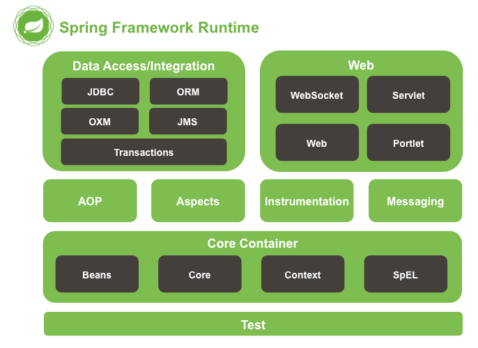
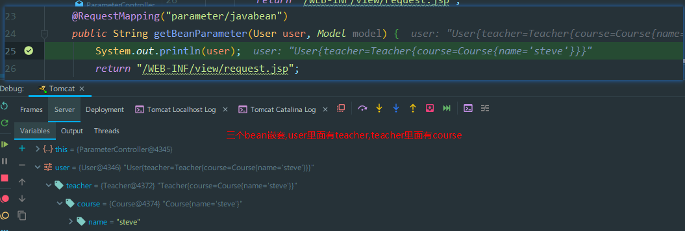
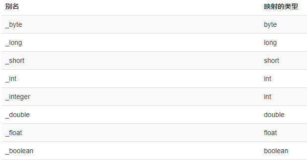
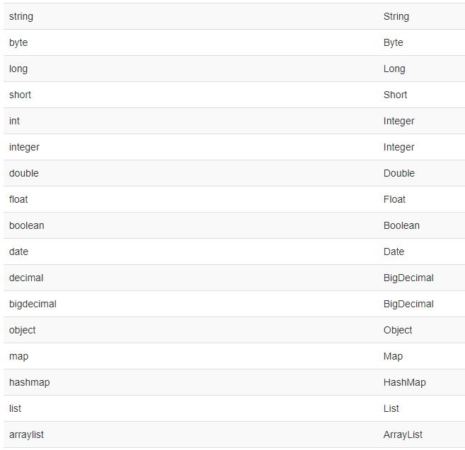
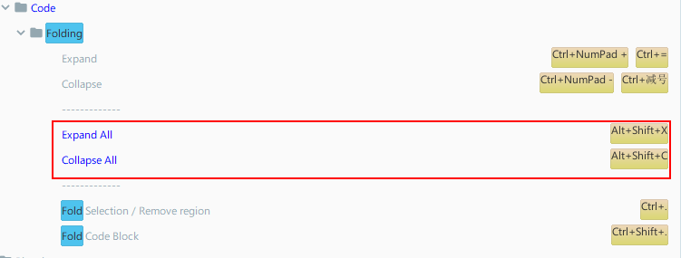
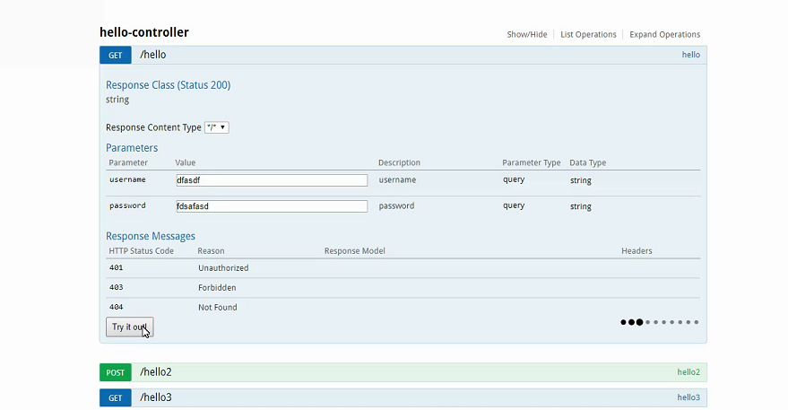

# PlanOfCS

## 2019：

6.20  
总结：自己学习IO流的知识。字节流和字符流（字节输入流InputStream，字节输出流OutputStream，字符输出流Writer，字符输出流Reader）
6.21
讲补码的过程中讲到数论中的同余，感觉挺有意思。看来数学对于计算机的影响还是挺大的。以后要学习数学的知识，离散数学，高数啥的，都挺重要的。
同余定理：数论中的重要概念。给定一个正整数m，如果两个整数a和b满足a-b能够被m整除，即(a-b)/m得到一个整数，那么就称整数a与b对模m同余，记作a≡b(mod m)。对模m同余是整数的一个等价关系。
6.22
计划:上午学习基础知识,下午自学java字节码操作,晚上写作业,整理面试题(尚学堂),看第一行代码
总结:上午和白天状态很好.下午有一点累  晚上状态还挺好. 第一行代码没时间看啦 ,晚上写了作业,整理面试题.
6.23
计划:看两三个类加载的视频, 总结一些java面试的笔记和题,看java第一行代码书
总结:看了三个类加载的视频,对类加载有了一定的初步了解，使用的是双亲代理（是代理模式的一种，就是讲所加载的类交给他的父类）。早上起来看了看尚学堂的Java面试题。晚上报了健身房，锻炼身体的感觉很好。打算以后每周健身三次，保持下去。
6.24
计划：上课认真听课，做笔记，晚上认真写作业。
总结：白天上课学习了,基础知识,比较令我眼前一亮的是位运算的深奥,竟然可以干好多事情。晚上写完作业以后，学习了类加载，完成了视频，但是理解还不是很深。希望以后的学习过程中，可以继续深入学习。
6.25
计划:白天学习基础,估计学习的是逻辑运算符. 可以开始看23种设计模式. 有时间晚上吧第一行代码看完.
总结:晚上听老师分享,感觉老师们很厉害都是985毕业.晚上写了作业,乘法口诀表花式打印,比较有意思.收获满满的一天.就是没时间可能第一行代码啦
6.26
计划:看两个设计模式的视频,看看第一行代码.
总结:看了三个设计模式,单例设计模式,饿汉式,懒汉式,静态内部类等  还有工厂模式,还有原型模式(克隆).  晚上剩余时间准备看看第一行代码.
6.27
计划:看两个设计模式, 看看第一行代码
总结:晚上完成作业,完成两个矩阵的相乘,用到三个for循环.这种思想值得学习. 晚上没有时间,看设计模式,回去也没有跑步
6.28
计划: 开始学习面向对象编程,每天要稍微预习一下  还有每天看30页Java编译思想
总计: 作业完成还好,编译思想看到30页,经过一段时间的写代码,打字速度有长进,一天顺利看完java编译思想,看了30页
6.29
计划:今天是周六,听完课程以后,顺利完成作业,晚上健身
总结:晚上健身效果很好,肱二头肌有撕裂的感觉.晚上还完成javai编译思想30页
6.30
计划:周日,理发,梳理一周学习的知识,收拾整理心情,准备迎接下周美好的一周学习时光!周末还是以放松为主!学习次要! 有时间学习一点也还好!
总结:晚上健身,开始主要练腹肌,希望在王道的四个月,腹部的肉可以下去,腹肌要是能出来,那就更好啦. 今天一天理发,周围小溜达一圈,java编译思想看30页多

7.1

计划:新的一个月,估计马上也要学习用IDEA,还是要做好和准备!继续保持好心情!(^-^)

```
类的初始化过程:
加载class文件
堆中开辟空间
变量的默认初始化
变量的显示初始化
构造代码块初始化
构造方法初始化
```

总结:开始学习继承,比较重要的知识就是上面写的,有些细节还是需要注意,比如在类加载过程中加载顺序: 静态快>构造快>构造方法,java编译思想看到了120页
7.2
计划:认真听课,java编译思想看30页,看到150
    总结:学习了接口,抽象类,接口包含抽象类的好多东西.   晚上的作业,第一次写代码,一个作业写250行,哈哈 爽死啦!很美好的一天!
7.3
    计划:今天王道组织素质推展
    总结:今天素质拓展学到了好多东西,比如不要给自己设置上限,每个人的潜力都是无穷的! 在最后的拉绳子活动,学到团体团队的力量还是很大的!
       一天的活动虽然有点累,但是收获应该是很丰硕的吧! 生活中的负面情绪没有什么是一个微笑解决不了的!
   远离垃圾人,远离负能量的人!
   自己把自己的计划执行好! 严格要求自己!
   晚上在这么累的情况下,还能坚持健身! 而且第一次喝蛋白粉,感觉挺奇妙的,和写代码同样重要的是锻炼身体啦!一定要保养好自己的身体!
   坚持锻炼!
7.4
计划:学习内部类什么的,java编译思想,看到210页
总结:开始使用IDEA,好多东西没有搞清楚,弄得心情很复杂!幸亏及时调整,没有慌,遇到问题解决问题!但是晚上的30页任务没有完成!周末补吧!
7.5
计划:上午开始学习Object,下午学String.看java编译思想到240页.(先看String部分也可以,周末补前面的),晚上停电,但我丝毫不慌!
总结:这两个知识挺难,老师讲的很细.Object中,需要重写的方法有:equals()和hashcode(华山剑法中写的:只要覆写 equals，就必须覆写 hashCode.)还需要重写的方法有toString方法()和clone()(想重写这个方法必须实现Cloneable接口)
7.6
计划:这周最后一天,抓住时间,不要浪费时间!剩余时间感觉看java编译思想.看到270页.晚上健身!
总结:晚上健身完,不是太想学习! 但是晚上健身效果很好!java编译思想顺利完成任务!
7.7
计划:上午好好休息,中午来了,把没看完的java编译思想,看完!晚上健身,练胸!
总结:java编译思想看到了310页,中间看不懂的直接跳过啦!
7.8
计划:白天学StringBuffer,Math,Date,以前学过,感觉还好! 
总结:早上来了有点浪费时间,现在刷题有点早,目标不坚定,不要跟别人的节奏.自己要往后面学,学java EE知识. 后面要学集合挺重要的,一定要认真学!
7.9
计划:学集合  整理一下 工作空间
总结:集合挺难,还是需要花多时间来学习,整理了工作空间,终于搞清楚了project和modeal  没时间看java编译思想啦
7.10
计划:学习集合,看编译思想 
总计: 晚上健身,花费了晚上的一个小时时间,然后让老师问候,以后周三不健身
7.11
计划:学习集合
总结:然后学基本数据结构! 虽然晚上的作业写完了,但是没有熟练!
7.12
计划: 学习集合,泛型,简单的互动(登录注册案例),在控制台中输出
总结:兰老师讲的,要把每天的代码敲一遍.试一试吧! 尽力完成! 还是要记住考研的教训,不要光看,还是要写很多代码!
7.13
总结:周六,上午听完课,下午和晚上吧ArrayList原码敲了两遍.  晚上八点半去健身,不管啥时候,都要记得锻炼身体,身体和代码一样重要!
7.14
总结:周日,早上起得迟!上午吃完饭,学习一下午!晚上准备练肱三头肌,加油! 
7.15
计划:新的一周,数据机构和集合讲完,估计就要将后面多线程和IO流,坚持!
总结:晚上将新的一天的代码,敲了一遍,感觉很好!晚上早早完成作业,早早回宿舍锻炼身体.
7.16
总结:上午学习了树,下午写了二叉搜索树,用链表写树,还是挺难的!晚上早早完成作业,10.40回宿舍锻炼!完美的一天!
7.17-7.20
计划:认真听课,将二分搜索树写完.空余时间看java编译思想!晚上吃饭的时候健身
总结:这次总结时隔好长时间.这一周讲完了数据结构,最后讲完了Map,集合告一段落.
7.22-7.24
总结:这一周开始讲IO流,老师讲的很快.自己的计划是,这一周过去,将java编译思想,大概过一遍,IO和多线程.下一周上三天,然后学javaEE啦,要看下一本书啦
7.25
计划:空余时间,敲老师的代码,看java编译思想
总结:后面的知识,java比编译思想没看完
7.26-7.29
总结:基本就是学的很快,完任务一样,学的不好!反射注解垃圾回收机制等!抽时间看书!
    7.30
总结:今天的反射啥的上课讲的Demo没有看完.周末有时间看看
7.31
    总结: Java SE最后一天,黑大帅说:学习要学习不变的基础知识,基本的知识不变,框架花里胡晒的. 往底层学java,需要c++知识,需要网咯,很多还有大学学习的计算机基础知识.这些知识不可缺少.
   周末看一下注解
8.1
总结:学习方法:最高效的学习方法是,课后根据老师上课讲过的例子,自己将代码实现出来,不用看老师的例子!(但是有前提就是得有一定的代码基础)!
   怎么敲代码? 看着敲码? JavaSE阶段的学习方法,有的地方出现一些问题,就是看着Demo敲代码,有时候只是敲了一遍,但是没有起到作用,以后能默写敲代码,就默写!

8.1-8.4

总结:三天数据库SQL语句
8.4
总结,有事周末不学习,放松!出去看了两个电影,哪吒和烈火英雄!   晚上看了个综艺!呵呵一笑!
8.5
总结:今天学的事务,挺重要,事务的三种隔离级别,面试会考!晚上坚持3km跑步!状态不错!  
8.6
计划:早上预习线程池,DButils,课间可以看看注解的视频,后面前段视频  将注解两个视屏看完!
总结:今天一天的课程每怎么听懂,本打算周三下午听听视频的,周三下午看了浪潮之巅  周六下午看看
8.7
总结:今天学Html,白天看了一天浪潮,晚上认真完成作业,但是没总结!
8.8
总结:今天学习Css,看着东西不多,其实挺难,晚上认真完成作业,总结总结!
8.9
计划:学习JavaScript
总结: javascript没学懂 
8.10
总结:晚上汇率转换原码有的部分没懂

8.12
总结抓紧时间敲Demo,晚上锻炼     蓝胖说:写Demo,写几行测试一下,不然一下写太多,测试,不可以的
8.12-14
总结学js中的Bom,Dom等.  从后面来看,蓝胖讲的有点浅啦!
8.15:
总结:在文件夹中,要打开控制vue项目的按钮,需要按住shift健,然后按powershell进去,  按npm run dev  ctrl + c结束命令行
   项目结构的介绍 怎么讲一个普通项目,部署成javaEE项目
8.16
总结:学习vue的各种高级操作!router vuex等!
  8.17-18
总结:整整两天时间写了猫眼电影的首页!收获满满!还学到了用Chrome浏览器进行调试前段页面!
8.19
    总结:学习了http,各种请求报文,响应报文,还有报文的头,用软件抓包,分析报文!  下午讲了,web,tomcat目录,和两种映射!  当文件不放在tomcat下Webapp时,映射找到文件!
8.20
	总结: 学习了servlet运行过程  如果虚拟机强制关机,第二次会啊打不开,然后以管理员身份运行

### cmd   netsh winsock reset, 

然后重新启动系统

​	  	修改 tomcat manger 账户:steve 密码:19950921y  进入网址:http://localhost/manager/html
8.21
​    总结: 将页面上面的表单提交到,在控制台打印, servlet类上面写注解@WebServlet("/request2")  

​    同时index.jsp页面上面action="http://localhost/demo01/request2" method="get"
​    http://localhost/demo01这个目录是tomcat配置的运行目录,后面的/request2,目录是注解的配置目录! (注意,一定要把目录写全)

​	将页面的表单(包含中文),通过servlet传到javabean,,然后显示在控制台,然后相应到页面(中间要求中文都能够显示出来)
​	//第一个设置编码,目的是为了将传入的表单中的中文设置成utf-8
 	request.setCharacterEncoding("utf-8");
 	//这个是相应的时候,要相应到页面的时候,要将servlet中的中文,反馈到页面上,所以要设置为UTF-8
  	response.setContentType("text/html;charset=UTF-8");
自从Tomcat5.x开始，GET和POST方法提交的信息，tomcat采用了不同的方式来处理编码，对于POST请求，Tomcat会仍然使用request.setCharacterEncoding方法所设置的编码来处理，如果未设置，则使用默认的iso-8859-1编码。
而GET请求则不同，Tomcat对于GET请求并不会考虑使用request.setCharacterEncoding方法设置的编码，而会永远使用iso-8859-1编码
 8.22 
 总结:1.线程池 DButils SQL  2.地址的两种写法 常用第二种方法  3.转发包含 转发留头不留体 包含留头也留体 4.response 三种设置响应头,解决中文乱码问题 5.转发 重定向 定时刷新,区别  6.开发目录,部署目录(out中)  7.三种方式 显示下载图片  8.各种路径的写法   9.员工案例,计算转账              
 8.23
 总结:1.转账案例  2.cookie和session会话技术 3.http无状态协议(服务器是否有记忆上一次请求的能力,服务器看来,每一次http请求都一样,彼此之间没有区别,并不能区分是一个用户请求了三次,还是不同用户各请求了一次  cookie和session就是处理无状态的)  4.获取用户上次访问页面时间  5.保留cookiesetMaxAge()里面加的是一个秒数,如果要删除,秒数写为0  6.删除cookie的时候,cookie的path一定要和创建的时候一样 7.不同浏览器之间不可以共享cookie  8.session  session依赖于cookie,cookie相当于session的门票!      9.session的创建和使用 ,session也是一个域,使用也是set 和 get 10.session生命周期 tomcat managr/html中看session对象详细信息     11.想让浏览器关闭后仍然可以访问到原来的session???  12.web.xml中可以修改session的存在有效时间  13.IDEA中的 tomcat 中repdeploy 将原来的session删除啦   14. 购物车 首页-->商品详细信息-->加入购物车    

```java
11中让浏览器关闭以后仍然可以访问原来的session
//在servletA中设置cookie
public void doGet(HttpServletRequest request, HttpServletResponse response)
            throws ServletException, IOException {

        response.setContentType("text/html;charset=utf-8");
        PrintWriter out = response.getWriter();
        HttpSession session = request.getSession();
        session.setAttribute("name", "张三");
        out.println("创建一个session并放入姓名属性");
        //手动添加cookie，保存JSESSIONID信息
        Cookie cookie = new Cookie("JSESSIONID", session.getId());
        cookie.setMaxAge(60*30);//设置cookie的生命周期为30min
　　　　相应 给浏览器一个 session id   
        response.addCookie(cookie);
    }


//在servletB中就可以正常访问session了
        public void doGet(HttpServletRequest request, HttpServletResponse response)
            throws ServletException, IOException {

        response.setContentType("text/html;charset=utf-8");
        PrintWriter out = response.getWriter();
        HttpSession httpSession = request.getSession();
        String name = (String) httpSession.getAttribute("name");
        out.println("name = "+name);
    }
```


 8.24    JavaEE项目记得要加classes目录  找生产环境的时候好找
 总结:1.文件长传  2.加载commions 架包  3.idea 上面菜单不见了 点击ctrl+shift+a -->action  然后里面搜索menu 然后将右边的开关打开! 4.ctrl+shift+alt+z也可以打开菜单 5.利用组件获取表单,会出现中文乱码,不能用之前的方法 6.设置参数 7.解决上传文件重名问题(加时间戳,用户id等) 8.将目录用哈希散列开 放到八级目录中 9. apache架包,打开每个jar包,下面user guide 里面有使用说明,下面的Javadoc是API文档

8.25
计划: 回来看看前面数据库池的内容 ,写一个总结论坛 8.22转账案例transfer  8.21反射案例 reflect  总结路径问题 等  将常用架包放到一起  整理以前javaEE笔记 (尚学堂的)

下一周:JSP filter MVC 
8.26 
总结:1.总结servlet执行过程 理清楚流程图 2.增删改查商品  一个方法复用  将jar包放到lib目录中,可以保障运行时不出错, 如果lib没有放jar包.在配置的时候 只是添加依赖,可以保障编译时不出错,保障不了保运行时不出错!   3.为什么上午将的有些获取数据库 的方法不能用getprim.... ?   4.不能用doGet调用doPost等 5. BeanUtils(request) 的使用  6.不要看老师代码,自己敲一遍(看着老师代码直接敲,效果不好,感觉就是在练习打字),根据自己的思路敲,不回来看老师的代码! 类比学习是学习高数的场景!类比以前初中那会学数学的场景!(那会都是自己独立完成的!) 5.JSP原理 看源码 tomcat work文件夹里面  6.三个域 

8.27

总结:1.监听器  自己实现一个监听器  2.过滤器的工作原理  3.不管什么监听,本质上都是回调  4.filter 5.filter生命周期 6.多个filter会组成一个链 

8.28

总结:JSON(JavaScript Object Notation)   MVC三层架构   加入dao层 

MVC和三层架构还没有看完(这周周末抽时间看一下) 

8.29

三层架构代码,先理清思路,每一层干什么,要弄清楚!

写代码是最后一步,提前要写清业务需求! 

写项目之前,要画出业务流程图.

8.30

第一个项目  练习抓包 按照老师的JSON格式来!  2.修改axiox地址 请求地址不能写192.168.2.100  

3.端口号改为8084  4.开发流程  启动Vue,关注两个axiox-admin client 5.跨域  设置一个响应头 Filter中(全局)   6.分发请求参数 ,进行具体的业务逻辑   7.跨域会发送两次请求 8.word文档加同级标题 : ctrl + shift + <--(左)

加子标题 : ctrl + shift + -->(右)

上下移动word中的表格或者文字 ctrl + shaift + up

第一个项目,实现管理员的增删改查,功能能够实现,但是细节需要修改! 记得每天完成接口文档!

8.31 总结:

多条件查询

sql语句多条件查询,拼接sql语句.

商品管理 和订单管理 先不做

9.2

1.添加外键是 相互关联的健的类型必须一样,如果goods表中specsList加了外键,specs表的id和其关联.   则specsList的类型也必须为int..

2.往数据库中添加数据,出现1064  You have an error in your SQL syntax; check the manual that corresponds to your MySQL server version for the right syntax to use near 'desc,img,name,typeId) values (Linux,/static/image/1567349613841Linux2.jpg,Linux,' at line 1

这个错误意思是用了mysql的关键字做字段,应该用数字健最左边的类似单引号的括起来!

3.1054 错误 是数据库中没有该字段.如果数据库中有该字段,看看是不是多个空格,要是没有空格,再看看要values后面的内容有没有添加""(引号).  但是用数据库连接池,?是不需要加""的!!!!

4.数据结构很重要的,有些逻辑需要数据结构

 

9.3  放行login操作  只过滤admin下其他操作

如果订单做完,可以试试权限控制,就是带同一个cookie头,然后才可以访问!

但是先写订单管理!

错误总结: 

1.JSON传输的时候,格式一点都不能少,前端要求啥,后端必须传输啥! 如果可以response接受到JSON,那么一定是格式不对!

2.写逻辑的时候,相应的表格要能查出来相应的数据,表格直接是有联系的,数据库不可以随便写!  

一定要注意数据库递增是id增加,其他表查不到相应的id!


遇到的问题:

java.sql.SQLException: Cannot set uid: incompatible types. Query: select * from orders

就是说 数据库中的uid 类型好javabean中的类型不一致导致的,所以在操作的过程中,要注意!

接收数据是可以用Map接收的!新建一个即可!

9.4 前端也写一个Filter /api/client/*

正则表达式  

重启虚拟机


评论不太合适  

9.5 事务 (connection) 

ThreadLocal

ThreadLocalMap 里面有好多ThreadLocal对象!

之前转账案例,如果出错,,后续都不会执行成功!

将事务运用于下订单和减库存,必须同时成功,才可以完成事务

账户:4444444@qq.com

服务器端新密码 Yy44444444@


评论有小问题 改true

添加订单会有问题 @@@@@

将密码设置成和账户一样 试试

去掉正则  注册的时候,将所有信息设置成一样,类似于admin


9.6 出去游玩,很开心的一天!

9.7 Maven

需要下载  里面有库  简化创建项目的过程 

9.9 maven

具体笔记迁移到了Spring里面

今天的maven web项目都不太合适! 结合设计模式里面创建!

9.10 设计模式

学习,当时要记笔记 ! 过一段时间没剩下多少东西啦!记了笔记,自己思考过,自己总结过,那才是自己的!当时听得设计模式,现在啥都不剩啦!(^-^)

自己画思维导图!

学一个东西,自己就要做笔记,总结!不图快!一直看视频,效果不好!

现在的学习方法太急躁啦,一个问题一个问题的学,自己写不出来的,永远不是自己的!

一个问题一个问题的解决!慢慢来!记录详细的笔记!


几种单例模式 

手写 


动态代理   类比汉堡

invoke响应 

debug的时候会调用对象的头String方法,比运行时打印更多的东西!


完成事务的操作!

按住Alt可以同时选择多行!然后可以对这多行进行同一个操作


9.11

Spring几大核心功能:

IoC/DI  控制反转/依赖注入

AOP   Aspect Oriented Program 面向切面编程

声明式事务



**ctrl + shift + alt + c 复制全类名**


MySQL版本要和依赖的版本相匹配!


Spring是一个更加复杂的map!

i18n 国际化相关的 

ORM object Relationship Mapping对象关系映射  

ORM 可以算是一个框架 

DispatherServlet 特殊SpringMVC的核心


面试常问 : 控制反转 依赖注入 

导包 5 + 1

aop beans core context expression + jcl(commons-log)


ClassPathmlApplicationContext

Spring里面对象 通常是单例

看类的继承关系 : ctrl + shift + alt + u

9.12

### 组件注册 

组件是基本类型 填value

如果是javabean填ref


有参构造

```java
<bean id="user" class="com.cskaoyan.bean.User">
        <constructor-arg name="usernamez" value="zhanngsan"/>
        <constructor-arg name="password" value="112345"/>
    </bean>
```

application.xml里面不能写接口的全类名,只能写类的全类名!

bean 里面的property中,name里面的是bean中的set方法中的值!

```xml
<bean>
	<property name="seter">
</bean>
```

通过接口也可以取出来实例!

截图软件 Snipaste

使用boolean,尽量不要用is... ,因为会和框架中的一些方法重名! 


9.14,9.15

debug的时候会调用toString方法,所以有时候会多出来一些方法!


要自己写代码! 不要看 !

周末写!

写一个锻炼分享帖!

来王道锻炼

9.15

切入点表达式  

返回值要写全类名

基本类型java.lang可以直接写 


注解最重要

自定义注解  计算时间

事务


9.16

Throwing 里面要rollback(出现错误以后,要回滚!)

**xml中的&用&amp表示!**

配置类 

@configuration


容器中组件的注册

@Bean("mydatasource")


将xml文件注册,写成Springconfig

ctrl + alt + v 提取出去一部分,将一部分用变量接收

转账之前要查一下账户余额!

aspectj 也可以变为javaconfig的形式!


```xml
&; &nbsp;
&gt; greater than
&lt; less than
```

事务隔离级别

TransactionDefinition隔离级别

隔离里面read-only 不可以对数据库修改 


demo04_javaconfig中  @Bean的作用

**Spring的@Bean注解用于告诉方法，产生一个Bean对象，然后这个Bean对象交给Spring管理。** 
**(和xml配置中的bean标签的作用是一样的)**


作业用的DBCP用的是Apache的 

```xml
<dependency>
            <groupId>org.apache.commons</groupId>
            <artifactId>commons-dbcp2</artifactId>
            <version>2.5.0</version>
</dependency>
```

DBCP作为数据源

```java
//DBCP中获取数据源的类时BasicDataSource,这名字和自己貌似没啥关系(^-^)
BasicDataSource basicDataSource = new BasicDataSource();
```

9.17

SpringMVC出现的目的是消灭servlet

听到了 第二个视频 20分钟!


构建springMVC项目时,web.xml文件中映射servlet-mapping一定要写成     **/**

/的意思是,*.jsp不交给dispatchsetvlet处理,其他的/..都交给他处理!


SpringMVC做的最核心的事情是分发!

老师推荐书 Spring实战


配置文件中要注册  映射器 适配器 

EL表达式  

### ctrl + shift + A  按出来action,然后,找各种1需要的操作!

springMVC项目要用到tomcat,所以要注意是否开启了tomcat

映射

窄化请求 RequestMapping("user")

请求方法限定 RequestMapping("",method = {RequestMethod.POST,RequestMethod.POST)

可以写一种,如果写两种,则这两种是or的关系,不写的话,是两种都可以!

GetMapping 限定了请求方式为Get

请求方法错误会报**405**错误,说请求方法不支持!


使用param限定请求参数

请求参数错误,会出现**400**错误!

多个参数是and的关系!

参数少了不行,写错了不行,多了可以!至少要满足基本要求!


consume限定请求头中的Content-Type

如果发生错误,不匹配时,会报**415**错误


produces: accept请求头的限定 

406错误 


controllor三种返回值

void

modeandview

string 物理视图 逻辑视图  没懂啥意思 


视图解析器  逻辑视图 


请求     forward redirect 对应的是请求之间的转发和重定向  

重定向地址栏变啦  


mvc2

请求参数的封装

直接进行参数的封装

请求参数和值要一一对应,一个都不能错 

通过javabean封装 


四个请求的表单 

springMVC项目,如果一直报404,检查一下tomcat


9.18 

mvc2 

批量操作按住alt健向下移动鼠标  多行可以进行同一个操作

梳理一下idea中好用的快捷键


错误:如果在mysql中看到这个单词syntactically,那么要去看一下是不是sql语句写错了!

错误:日期是date

​		数据data,细心,这个不容易发现


数组参数的接收 

中文乱码 filter

日期类型  转换 


文件上传的组件id是写死的  必须写multipartResolver 

还要写文件上传的依赖 

限制文件上传大小  (^-^)


### 为了让springMVC访问到静态资源 

首先需要将静态资源图片放到webapp/images目录下

然后需要在application.xml中加一句匹配

```xml
<mvc:resources mapping="/images/**" location="/images/"/>
```


第一种方式:其实有时候还需要好多静态资源,例如html.css等,也是通过这种方式访问

```xml
<?xml version="1.0" encoding="UTF-8"?>
<beans xmlns="http://www.springframework.org/schema/beans"
       xmlns:xsi="http://www.w3.org/2001/XMLSchema-instance"
       xmlns:context="http://www.springframework.org/schema/context"
       xmlns:aop="http://www.springframework.org/schema/aop"
       xmlns:mvc="http://www.springframework.org/schema/mvc"
       xsi:schemaLocation="
        http://www.springframework.org/schema/beans https://www.springframework.org/schema/beans/spring-beans.xsd
        http://www.springframework.org/schema/mvc https://www.springframework.org/schema/mvc/spring-mvc.xsd
        http://www.springframework.org/schema/aop https://www.springframework.org/schema/aop/spring-aop.xsd
        http://www.springframework.org/schema/context https://www.springframework.org/schema/context/spring-context.xsd">

    <context:component-scan base-package="com.cskaoyan"/>

	<mvc:default-servlet-handler />
    
    //这里需要啥 加上啥就可以啦!	
	<mvc:resources mapping="/${mapping_path}/**" location="file:${local_path}/">
	<mvc:resources mapping="/js/**" location="/js/"/>
	<mvc:resources mapping="/css/**" location="/css/"/>
	<mvc:resources mapping="/images/**" location="/images/"/>
	<mvc:resources mapping="/plugin/**" location="/plugin/"/>
</beans>
```

第二种方式:

在web.xml文件中写一个,用默认的servlet,就可以访问.jpg文件啦!(不过大佬说,这种方式好像不太好!(^_^)不懂!)

```xml
<servlet-mapping>
    <servlet-name>default</servlet-name>
    <url-pattern>*.jpg</url-pattern>
</servlet-mapping>
<servlet-mapping>
    <servlet-name>default</servlet-name>
    <url-pattern>*.png</url-pattern>
</servlet-mapping>
```


三个bean嵌套    user里面有teacher,teacher里面有course

http://localhost/parameter/javabean?teacher.course.name=steve




9.19

word和markdown相互转换

需要的是两个软件,同时安装,一个是转换用的,另一个是避免命令行简便操作的!

软件是网址:http://www.writage.com/

使用说明:https://www.jianshu.com/p/df6a136d06d8


早上将d盘分20G到c磁盘.用的软件是 diskgen..  百度经验!  贼6!


rest风格接口  

访问静态资源

spring MVC拦截器 


当执行了prehandle1,一定可以执行到afterComoletion1(中间受阻断可以可以的!)

如果prehandle有三个true,则执行为1234321!


**自定义异常处理器!**

**有些参数 后面加一个字母!避免和系统变量一样,访问不到!**


**demo01**后面两个访问不到


9.20

json exception

异常处理器  返回json数据 


freemarker

八个步骤 一个一个写 

这个模式非常类似建造者模式 


**白天用白彩虹!**

**晚上用暗黑彩虹!**

如果访问放行的servlet,要可以访问!


安装xmind   ko


视图解析器!配置了前后缀,只写名字即可!

画MVC思维导图!

fileupload中包含了commons-io!


如果是mvc的在mvc中找

如果是一般的xml另一个中找!


Xmind常用快捷键 

选中方框 ,点击空格输入文字

ctrl+i插入图片

enter插入同一级主题

tab插入子主题

ctrl + "+" 放大主题 


插入超链接ctrl + h

换行 shift + enter


买 个visio  ko

搞个oneNote


9.21

mybatis 

用sql语句的时候,先从navicat中查询一下

然后再放到mybatis中使用


查询的时候 不要select * 要啥,查啥 

查询一个list,不加where

如果查询string,resultType中可以写string

多用查找替换 构建sql 速度快


mybatis需要提交事务!不然插入没反应!

还需要关闭!

1224932-9070570-1179546-3609780-8659576-3209685-2600926-0720310-7844883


9.22

今天遇到一个问题,javaconfig中,视图解析器中的东西没有起到作用!让大佬找了好长时间!最后发现是pom.xml中中没有写

```xml
<packaging>war</packaging>
```

没有写这句话,然后webapp目录相当于没有起到作用!

artifact也是自己加的!开始总感觉自己加的不对! 就是不知道为啥!

打成war包以后,javaconfig中的所有的东西,都就起作用啦!(^-^)


还有一种解决问题的思路就是,如果web项目中某一些jsp.或者图片如果报404,就去对应的target中找一下,如果没有的话,就重新部署一下,或者直接拷贝进去!


还有一个问题,通过浏览器直接访问的.jsp文件,要放到webapp目录下.不能放到WEB-INF目录下!


还有一个小细节,如果发现错误发生在dao层,断点就直接打到dao层,不用继续从前面开始找啦!


遇到一个问题:


始终查不到,后来发现是没有加"" , 以后查字符串注意!!!


9.23

mybatis中基本类型别名,前面加_



包装类型,变小写



**代码提示软件,国产AI  AIXCoder**

518042968 软件qq交流群


原来的dao层,现在叫mapper

在resources中建造目录是用/分割

com/cskaoyan/mapper

不能用com.kaoyan.mapper

这样文件名叫这个整体啦!


### **备份一下系统!**


硬盘克隆!用于大批量安装同一种系统的人来说,好用!


日志级别!使用的使用,一般不常用debug,会生成太多大量的信息啦!一般可以写info!


日志文件读取分离内容!

alt + ← 

alt+ → 窗口切换


输入映射

无注解 四种类型 

基本类型 javabean map 多个参数 (parm和arg,混合类型)

有注解 @Param  

**可见既可用!**


**代码要自己写!**


输出映射!

基本类型的参数输出!


**每天将要做的事情,按重要程度排个名!**

最重要的要最开始做!

在当时不那么重要的事情,最后有时间在做!

注意力要集中!


有一个需要注意的点!

MapperTest中写了对应的mapper的方法,则UserMapper.xml中一定要有对应的<select>或者其他与之对应!

反过来,不一定!MapperTest中没有也可以的!


9.24


trim  choose when otherwise 

sql标签

selectKey

orderBrfore

foreach

separtor 两两之间加逗号


像刘中磊老师学,写sql业务之前,先在navicat上面建立一个查询语句,如果查询语句能执行出来,再放进去查询!


左连接!第一张表中的数据,一定可以查出来!

**左连接** 看以前笔记!


连接查询,只查询一条,.xml中写两条!

test中只有一条


多对多,比一对多,多连接了一次中间表!

mybatis第三天的好多东西没看完!


9.25

orm懒加载 默认是开启懒加载的

一级缓存 sqlsession 默认开启一级缓存

执行commit会销毁一级缓存!

二级缓存可以使用,但是不建议使用!


别名,不同包下同一个类,可以考虑加一个别名!

**记住要加去除同名表的一句话!**


整理一下 javaEE笔记 


9.26 

逆向工程里面的东西是可以修改的!

多表查询的语句,不能自己生成!

这个就是起到一个辅助的作用!

做一些脏活!自己还是要根据自己的需求进行修改的!


如果没有提示导入的包,双击shift,搜索出来,导入全类名!


sublime


springBoot  

start.spring.io

yml :(冒号)后面要加一个 空格 

要注意的是,不要用tab键!

同一级目录对齐就好,前面两个空格,三个空格都行!

慢慢经过不断地学习,发现公众号里面的文章慢慢的能看懂啦!


ConfigurationProperites打破了配置文件和spring的隔阂!


importResourse 可以引入以前的配置 


**修改项目名字 在项目配置里面修改,然后过一会,就可以看到名字发生了变化!**


9.27

yml格式的profiles

---是分割符

这个profiles应用场景是多个人各用各的配置文件,用哪个激活那个


打jar包


filter 

listener

templete

注意mysql版本 默认8.几 现在要5.1.47


springboot默认连接池不是以前用的三个 

要想用druid还有自己导入


自动配置 的注解 非常重要 

EnableCongiurationProperties


springboot整合日志 

slf4j 抽象层 


日志如果不加盘符,会在当前项目所在盘,生成日志log

**生成位图工具**


9.28

1.SpringBoot中的demo5加了过滤器,就会出现错误 !明天问问大佬!

经过询问大佬,结果是:写过滤器的时候,要重写三个方法!

像老师一样只是重写doFilter是不可以的!  具体为什么,我也不知道啊!


2.demo7  也有问题 java.nio.charset.MalformedInputException: Input length = 1

解决方案是:重启了一下idea,哈哈,美滋滋!


由今天向周大佬学习所得:

周大佬什么代码都能自己写出来,牛逼啊! 

这是咱要学习的点!


9.29

课前回顾 

老师所说:

自己先回顾所学,然后自己回顾!

如果自己回顾不起来,在看老师的review,然后自己找知识点,这样效果好一点!


在命令行克隆的快捷键 shift + insert 粘贴

ctrl + insert 复制

git init --bare 名字


一个项目组 统一提交格式


git的账户密码  目录:C:\Users\Steve\.gitconfig


用wins不能创建  ,要用linux命令!

touch .gitconfig


找放大字体操作

版本回退 是个艰难的决定! --hard


chackout 只能回退,工作区修改啦,但是还没有提交的操作!谨慎操作!


字节码文件不需要提交!idea配置文件,也不需要提交!


文件的忽略配置!三种!

target/  文件夹

.gitignore  文件

*.iml某一种文件


本地和仓库 都要有分支

分支可以合并


git上面显示的是用utf-8,所以提交上去的文件要用utf-8


responseBody

仓库文档  人名

分工 敏捷开发 

晨会记录 记录上 上传到github

.gitignore


将快捷键 换回来 下面这是以前的 eclipse快捷键




**总结:**

要看前端传的数据是啥格式,要是json格式,当然要用bean来接收,要是一般的分散开的,直接参数接收就行!


Mybatis逆向工程会生成实例及实例对应的example（用于添加条件，相当于where后的部分）

写之前,一定要先看清楚,用的是逆向工程中的那个bean


**技术一定要多交流!相互直接要分享,新技术,和新用法,这样开发效率高一点!**


**同一个url,如果参数不同,可以用一个bean来接收!**


空字符串和null,是两种情况

```java
(steveGoods.getGoodsSn() != null && !"".equals(steveGoods.getGoodsSn().trim())) && (steveGoods.getName() != null) && !"".equals(steveGoods.getName().trim())
   
```


数据库中vachar字符串转换成字符串数组


10.1

查询total有更好的方法

平时好好自己敲代码!做项目的时候,捉襟见肘!

前面算总页数的地方有点问题

10.2

权限管理shiro


认证是授权的前提!

有大门钥匙,才可以进卧室门!


日期上面 bean里面加一个@json...

可以修改日期格式


重启电脑以后,一定要重写打开数据库


还要select 不能select *


**多写一些异常处理,就不会出现让程序不能运行的异常**


ctrl + F12 显示类中1方法


sql 语句去重 


**授权没学**,然后补上


10.4

druid 监控 可以看sql运时间 

**${} 和#{}有区别 面试要问** 

${}做的是字符串拼接(不好) 使用的是**字符串拼接**

#{}做的是预编译 

就是将sql语句加了一个""

```sql
select * from j16 where name = "steve"
```

#{}相当于 

```sql
selet * from j16 where name = ?
```


自己要学会看官方文档Hexo文档 


**数据校验 用专门的框架** 

学习完shiro还是要记一些笔记!

同时按住alt复制,可以复制到某一列的东西!

Markdown插入表格如下:

| 姓名 | 嘻嘻 | 嘻嘻 |
| :--: | :--: | :--: |
| 李四 | 嘻嘻 | 嘻嘻 |


加shiro  加log  视频看到了第三个14分钟


10.5

早上问问怎么加log 验证shiro 然后写小小程序


阿里云   

oss 文件上传 9元 对象存储  

短信服务 200元 5000条 

怎么保证获取验证码的时候,session是一样的!

改一下,前端,需要给他加一个,请求头  保证让他的session一样!


新知识  

10.8

导包 

写接口文档 

swagger2 

localhost:8080/swagger-ui.html




MD5 消息摘要  加密算法 

对称  哈希算法 非对称 (公钥 私钥 大质数)

**公钥加密私钥解密**

**私钥加密公钥解密**

**私钥签名公钥验证**


MD5上传文件非常快,其实是服务器算出了这些文件的MD5,如果服务器有的话,直接给个索引即可!实际上是没有上传的!所以速度非常快!


cmd5.com   可以"反推"出来!本来这些东西是1不可以反推的!

其实是他提前算好,放到数据库中,然后根据数据库中的东西,进行key - value 的一一对应!


将对称性加密的秘钥,使用非对称性加密进行加密!


10.9

现代操作系统的鼻祖是unix

win上面也有一个类似于shell的工具,可以控制 ,linux系统!


安装shell 需要安装ssh


10.10

安装vim编辑器!

sudo ..............

周末 看一下短信 和 对象1存储!

共享session  配置 session分发 

总共四种 学了两种 


10.11

微服务 dubbo 传输层协议

springclond http 应用层协议!

阿里架构 发展!....................................


dubbo  github  上面有操作 

zookeeper挂掉  还能不能调用?

能,本地有缓存!


心跳机制 

配置启动检查 check = false ;


spring + dubbo 第三个视频到59分钟! 明天看的时候,记得打开zookeeper!

10.12

Mybatis-plus 

guns-rest 影院开发 蓝本


后台管理系统 可以生成代码块 controller等 还有shiro 

Fehelper json 插件 

修改 鉴权机制 生效 


代码生成器  修改包配置 

这个生成的mapper service 上面自动加了注解的@Service等,很好用!


复制rest ,打开设置,要修改(不合适可以修改)

controller要写在getwey里面

api包 相当于昨天1的common包 


和网关相关端口80

和业务相关 8080 8081 ..

zookeeper 20880 20881 ...


**长传百度云的文件打个压缩包!传起来速度快!下载速度快!而且不会出现文件太多上传太慢的问题!**


guns-admin 后台管理系统!功能很强大

guns-core核心包的代码 

打包方式是jar pom文件中有

**学到了 代码生成器那块!**


10.14

JWT  JSON-Web-Token

Token是放在请求头里面的!

客户端来维护的!

JsessionID防在服务器端,使用过程会增加服务器开销!

Token可以防止攻击!因为没有会话!


JWT是经过加密的!暂时是安全的!


如果发生了错误,定义了一个全局异常处理器!

枚举类  创建类的时候选择Enum就会自动创建枚举类!  

枚举类上面的信息,和下面的成员变量之间,有一个分号**;**

也可以给枚举类型,生成set和get方法!

异常处理  一直在往上抛,在网关里面进行处理!


还用到,md5 有明文,密文 !

保密是有期限的!


用户模块 进行登录 单点登录!

密码是MD5算出来的,同样的算法再进行一次,就


退出登录 就是要将redis里面的token干掉!


**lombok** 插件工具包 1.16.20 

控制bean中的seter geter 和无参构造 tostring等!

@Data 集大成版本 


mybatis-plus IDEA 插件 **mybatisx插件** 

mybatis-plus官网上有详细文档!哈哈!


10.15

resdis 有软件 需要解压

redis-server 6379 启动

redis-cli 客户端 

这里有一个注意的点,服务器启动了,客户端才可以启动!


telnet 192.168.2.100 6379 远程控制阿里云的redis

auth 是密码


**RDB AOF redis两种策略** 

两种策略面试会问 

各有什么优缺点 等

 RDB 把当前进程生成快照,保存在磁盘中

里面信息会丢失的  存储不太重要的数据 


redis 和HashMap

HashMap 是运行在JVM上面的

redis是另一个进程

两者之间可以放在不同的机器上面运行


setnx 如果有的话,不设置,如果没有的话,是需要设置的!

list是以栈的形式存放,0表示栈顶的元素!

hash二维表

set无序集合

redis 面试问的很多

四种数据结构 


项目中结合redis

开启服务?

flushall 删库命令

guns中,容器中注册一个 

然后其他地方如果要用的话,需要@Autowared


单点登录  以redis里面token时间为准

过滤 写忽略列表  放行列表 

guns-geteway 里面jwt里面


注册前端 账号

steve

密码中银


10.16

微信支付  有相应的接口

微信开放平台 


第四方接入  七行代码接入 

支付宝开放平台  接入支付宝接入 

扫码的 是当面付(网站下面)

沙箱版本 (测试版) 还有沙箱版本手机支付宝 


open_api_demain 换成网关 


有一个RSA签名软件 

还要将二维啊地址 改成自己的 

还可以测试是否支付什么的


10.16 

还要记得对订单分页分页


前端配置 

nginx配置跨域要和前端url

地址一样!


新注册的用户

账号是steve

密码是123456


wins上面的nginx启动了以后,会有一个黑框一闪而过 ! 

说明启动成功啦!


抽时间看SQL优化!

https://www.bilibili.com/video/av29072634/?p=5

看到第六个视频 9分钟!


10.17

秒杀 高并发 

提高接口相应速度  缓存 异步 无锁 

异步操作 让同桌写接口 哈哈 


高并发系统三把利器:

缓存,限流,(服务)降级

拼多多 抢购完毕以后,订单信息查询不了,这就是给查询订单服务降级!

限流,小米抢秒杀资格! 相当于限流啦!


Apache jmeter   .bat 打开 

Apache ab 压力测试


添加 

linux上测试 负载

load average 负载 


单独写一个服务里面

今天发现 word转换成markdown以后,忽悠一些文件缺失!


mtime_promo_order  表里面,兑换码,可以是时间+uuid,反正要保证他的唯一性!


每次秒杀操作以后,还要将秒杀放到mtine_stock_log


研究mybatis如何使用

查看这个方法需要什么参数 ctrl + p就可以看到啦!需要什么参数,传什么参数!

**zabbix监控系统的软件** 当然还有其他好多监控！


java内存分配 

java8 垃圾回收器 java11 垃圾回收机制 


idea中导入的MQ的包是，客户端的包！


10.21

银行用的放钱的数字类型有单独的 D..

四舍五入五留双


将数据存到redis缓存中 

@slff4j 启动log日志


写代码 顺便写日志 不然找不到 错误发生地方

分布式事务 


阿里 GTS解决分布式事务 


库存流水表 追踪本地库存状态

输出日志,根据不同的数据,用占位符,输出不同的数据!


生产者 写到一个地方,消费者可以随便写到其他地方,都是可以用的!


10.22

秒杀令牌

拿到令牌以后 才能秒杀!


阻塞队列 

线程池 

队列泄洪 


防刷限流技术 

验证码 

谷歌令牌算法


**学了个新知识点:枚举的定义!**

10.24

给自己列一个时间表  以周为节点 

流程是先写简历 然后复习

简历要自己写 自己写自己的技术栈 


第一周 写简历  时间节点 到下一周 之前 

第一周要投 要有面试 

第三周第四周 要有offer 


不要全面的复习 

一遍投 边准备  面试官 的工作是找到你知识的边界 

要即使和组长沟通 问清楚  

工作以后   要提前完成代码.不要等到最后一刻!时间很重要!

既然公司要让我干的,一般不太难,要是太难的,领导给我,那是领导没看清楚人!

所以不要先说自己不会! 试试!


写简历 

少用wps  给HR发的要保存成pdf

给老师的 要用 word 可编辑 加批注 


写简历 扬长避短    

政治面貌 党员  

专业 电子  

籍贯近的话 要  远了 不要 

照片 不要 

简历 不要  

前端要写一些 了解 

了解 linux基本命令 


**个人技术 要写详细一点** 

**spring 生命周期 aop ... 逆向工程** 


电商项目  写两个 

 pc端  秒杀 

手机端  小程序  

基于dubbo的电影购票系统 

项目名 可以写技术名 或者 名字 


项目描述 有个网站   偏功能的!

秒杀中的缓存

技术要点 :  用了什么技术,解决了什么问题,速度显著调高!

用了二级缓存,提高首页的访问速度!


**不能技术名词堆砌!**

**好的技术描述是结合业务去写的!**


自我评价! 要自己写! 

要举例来说! 


看一个公司产品 和股票 首先自己 看一下 如果你自己都觉得新颖,好用

那么,这个公司东西是好用的!股票也不错!


接到HR电话 用纸和笔记下电话 时间 等!

和HR交流 不卑不亢 


面试流程可以先问一下 

要带简历  自己打印  

买房子可以迟,但是要早早关注 


希望不忘记王道的优良传统，坚持锻炼身体，不忘初心！抱着对技术的热爱和执着干这个行业！加油，要相信自己我可以的！（^-^）, 自己的生活自己要说了算！ 不要寄托于任何人！